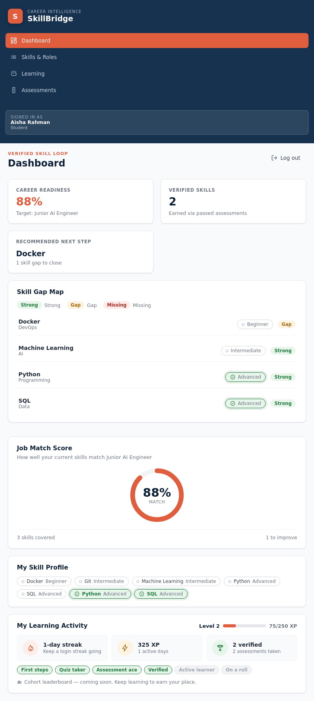
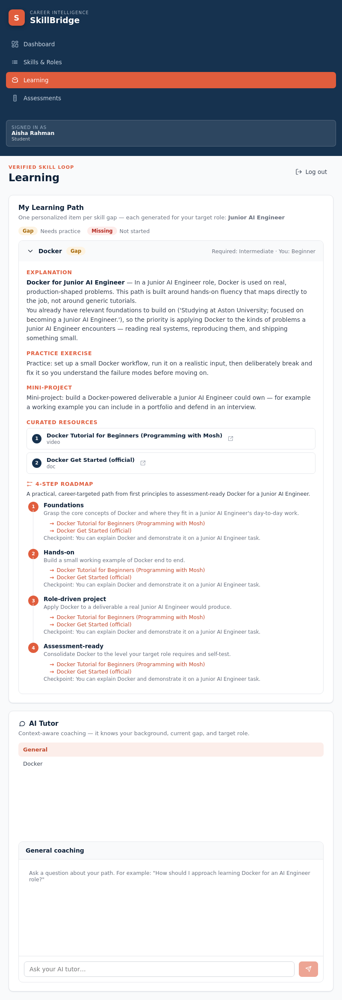
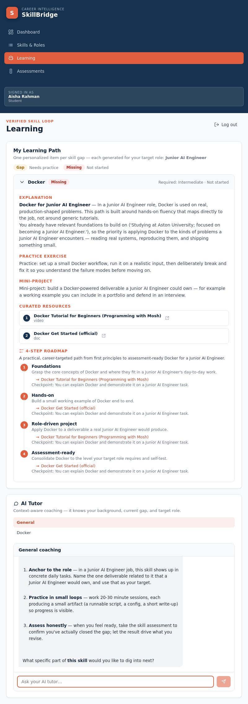
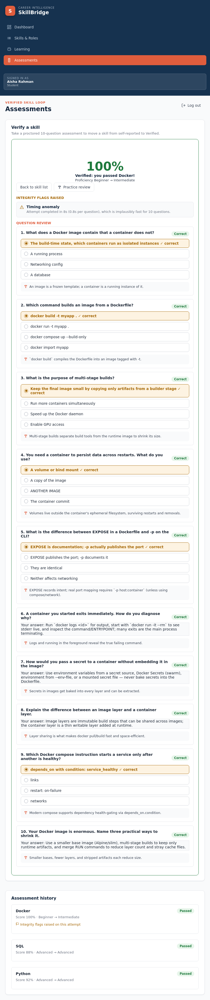
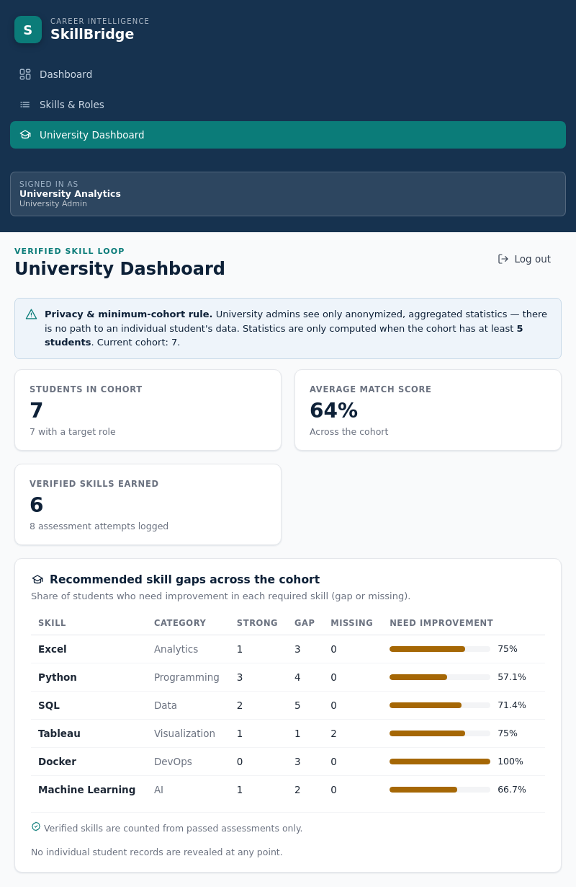

# SkillBridge

SkillBridge is a GenAI-powered career-readiness platform that closes the gap between what
students learn at university and what companies actually need. It connects students, companies,
and universities around one loop: a company defines the real skills a role requires, a student's
actual skill level is measured (not just self-reported), GenAI generates a personalized learning
path for every gap, the student is re-assessed under integrity monitoring, and their **Verified
Skill Profile** updates so their match to real roles improves.

This is a focused prototype demonstrating the full loop end to end — extraction, personalized
generation, and verified re-assessment — not a production platform.

## Screenshots

From the running app as all three roles — Student, Company, and University Admin.

| | |
|---|---|
| **Sign in** | **Student dashboard** |
|  |  |
| **Learning activity — streak, XP & badges** | **Skills & Roles — choosing a Target Career** |
|  |  |
| **Company — defining a Role** | **Learning path — explanation + roadmap sources** |
|  |  |
| **AI Tutor chat** | **Assessment — pass moves a skill to Verified** |
|  |  |
| **Assessment — integrity flags raised** | **University dashboard — anonymized stats** |
|  |  |

## Stack

- **Backend:** FastAPI (Python) + SQLite (stdlib `sqlite3`), no cloud dependency.
- **Frontend:** React + TypeScript (Vite), served by the FastAPI app.
- **GenAI:** real API calls (Anthropic or OpenAI) for the four touchpoints, with a
  deterministic fallback when no key is set.

## Project structure

```
backend/
  app/
    main.py        FastAPI app + all routes + SPA static serving + university stats
    database.py    SQLite schema + migration + shared connection
    models.py      data layer (CRUD + learning/tutor/assessment/verified helpers)
    matching.py    skill-gap + job match engine
    integrity.py   proctoring flag heuristics (tab-switch, timing, AI-text detection)
    genai.py       the four GenAI touchpoints (live call + deterministic fallback)
    auth.py        password hashing, session/reset tokens, Google OAuth client
    mailer.py      SMTP email delivery (verification + password reset)
    resources.py   curated learning resources for learning-path items
    seed.py        realistic sample data + country -> university reference list
  tests/           unit tests (CRUD, matching, extraction, learning, assessment, university)
frontend/
  src/
    pages/         Login, Dashboard, Skills & Roles, Learning, Assessments, University
    lib/           api client + types
    components/    icons + UI widgets
    AppContext.tsx auth/session state shared across the app
scripts/
  setup.sh          one-time env setup (idempotent)
  test-backend.sh   run all backend unit tests
  verify.sh         run an end-to-end API verification against a fresh server
  start.sh          single-command startup
```

## Run (simplest — one command, works everywhere)

**One command** starts the whole app (frontend + backend + seeded database) and opens it in
your browser. It works the same in **VS Code PowerShell, cmd, Git Bash, WSL, macOS, and Linux**
— no long setup, no separate steps.

```bash
git clone https://github.com/khaled1234kh/SkillBridge.git
cd SkillBridge
npm start
```

Then open **<http://localhost:8000>** (it automatically picks another port like 8001 if 8000
is already in use).

> Prerequisites: **Node.js 18+** and **Python 3.10+** (both on your PATH). That's it —
> everything else (the Python virtual environment, frontend dependencies, and sample database)
> is installed automatically on the first run.

What `npm start` does automatically (only the first time — after that it's fast):

1. Creates a Python virtual environment (`.venv`) with all backend dependencies.
2. Installs frontend dependencies and builds the frontend.
3. Seeds the SQLite database with realistic sample data.
4. Starts the server and prints the URL to open.

> Everything runs locally with just SQLite — no cloud dependency, no account needed.

Useful options:

```bash
npm start -- --reset      # wipe the database and re-seed fresh sample data
npm start -- --dev        # run the Vite dev server (live frontend reload)
npm run setup             # install dependencies only, then exit
npm start -- --port 9000  # run on a specific port
```

The other entry points (`start.sh`, `start.ps1`, `start.bat`) are just thin wrappers that call
the same `npm start` — you never need them.

### Demo accounts (password for all: `demo1234`)

| Role             | Email                |
|------------------|----------------------|
| Student          | aisha@student.edu    |
| Student          | omar@student.edu     |
| Company          | hr@northstar.com     |
| Company          | hr@signal.com        |
| University Admin | admin@univ.edu       |

### Try the full loop (~5 minutes)

1. **Company** — log in as `hr@northstar.com` → **Skills & Roles** → define a role
   (name + required skills + proficiency levels). It persists after refresh.
2. **Student** — log in as `aisha@student.edu` → **Skills & Roles** → **Upload CV**
   (any `.txt` transcript listing skills works, e.g. a line like
   `Python (Advanced), Machine Learning (Intermediate)`). GenAI extracts a
   self-reported skill profile, visibly labelled **self-reported** (outline tag),
   then pick **Junior AI Engineer** as your Target Career.
3. **See the match** — back on the **Dashboard**: the Career Readiness score, the
   Skill Gap Map (strong / gap / missing), and the My Learning Activity card.
4. **Learn** — open a gap on the **Learning** page: explanation + curated resources
   + roadmap, then chat with the **AI Tutor** (replies use your context).
5. **Get Verified** — from **Assessments**, start an assessment for a gap skill and
   answer the questions. On a pass (≥70%) the skill moves from self-reported to a
   green **Verified** tag and the match score recalculates.
6. **Flags** — on a fresh attempt, switch tabs mid-quiz (or paste an AI-style
   answer): the result screen logs **Integrity flags raised** (tab switch + AI-text),
   showing the proctoring around assessment attempts.
7. **University** — log in as `admin@univ.edu` → **University Dashboard**: only
   anonymized, aggregated skill-gap stats across the cohort — no individual data.

## Accounts, sign-in & verification

- **Create an account** from the login page as a Student, Company, or University Admin.
  Student and University Admin signup uses a cascading **country → university** dropdown fed
  from a seeded reference list (a university not listed can be typed in via "Other").
- **Google sign-in** uses real OAuth credentials when `SKILLBRIDGE_GOOGLE_CLIENT_ID` /
  `SKILLBRIDGE_GOOGLE_CLIENT_SECRET` are set. Without them a clearly-labelled demo Google
  provider stands in so the flow stays demoable.
- **Email verification:** when SMTP is configured, local accounts start unverified and a
  verification email is sent; clicking the emailed link (`/verify?token=…`) activates the
  account. When SMTP is absent (demo) accounts start verified so the app stays demoable, but
  the verification flow remains available.
- **Password reset** requests email a reset link (or show the token in demo mode).

## Configuration

All configuration is via environment variables — no secrets are committed.

**`.env` file (recommended).** Copy `.env.example` to `.env` at the repo root and fill in
values. The backend now loads this file automatically on startup, so you don't need to export
anything by hand. Real shell environment variables always win over the file.

```
cp .env.example .env   # POSIX
```
On Windows PowerShell:
```powershell
Copy-Item .env.example .env
# then edit .env to add keys, OR set for the session:
$env:ANTHROPIC_API_KEY="..."
```

**GenAI** — the four touchpoints call a real provider when a key is set, and fall back to a
clear deterministic generator otherwise:

```bash
export ANTHROPIC_API_KEY=...   # or OPENAI_API_KEY=...
```
PowerShell: `$env:ANTHROPIC_API_KEY="..."`

**Google sign-in** (optional, else the demo provider is used):

```bash
export SKILLBRIDGE_GOOGLE_CLIENT_ID=...
export SKILLBRIDGE_GOOGLE_CLIENT_SECRET=...
```

**Email / SMTP** (optional, else verification links are logged instead of sent):

```bash
export SMTP_HOST=smtp.example.com
export SMTP_PORT=587
export SMTP_USER=you@example.com
export SMTP_PASS=your-app-password
export SMTP_FROM=you@example.com          # optional, defaults to SMTP_USER
export SKILLBRIDGE_APP_URL=http://localhost:8000   # base URL used in emailed links
export SKILLBRIDGE_EMAIL_DISABLED=0       # set 1 to force demo/log mode even if SMTP is set
```

Emails are delivered on a background task, so a slow or unreachable SMTP host never blocks or
freezes the create-account / password-reset request.

## Tests

```bash
# backend unit tests
./scripts/test-backend.sh

# end-to-end API verification against a fresh, seeded server
./scripts/verify.sh
```

An automated browser walkthrough (Puppeteer) drives the running app as all three roles —
defines a role (Company), uploads a CV and gets matched (Student), takes an assessment and
sees the Verified badge appear, deliberately triggers an integrity flag, and views the
aggregated University Dashboard — confirming no browser console errors.

## What the app keeps track of

- **Student** — name, email, university, target role, self-reported skill profile (extracted
  from CV by GenAI), verified skill profile (built only from passed assessments).
- **Company** — name, industry, and the roles it has defined.
- **Role** — a job title with required skills and proficiency levels, owned by a Company.
- **Skill** — name and category, shared reference list across CVs, roles, learning paths, and
  assessments.
- **Assessment Attempt** — student, skill, generated questions, answers, pass/fail score,
  integrity flags (tab-switch, timing anomalies, suspected pasted-AI text), and the
  before/after proficiency level.

## Out of scope (v1)

No webcam/biometric proctoring (integrity signals are simulated), no real job-post scraping,
no cryptographic credential signing, no payments, no mobile app, no email/calendar
integrations, and no multi-university or multi-language support.
